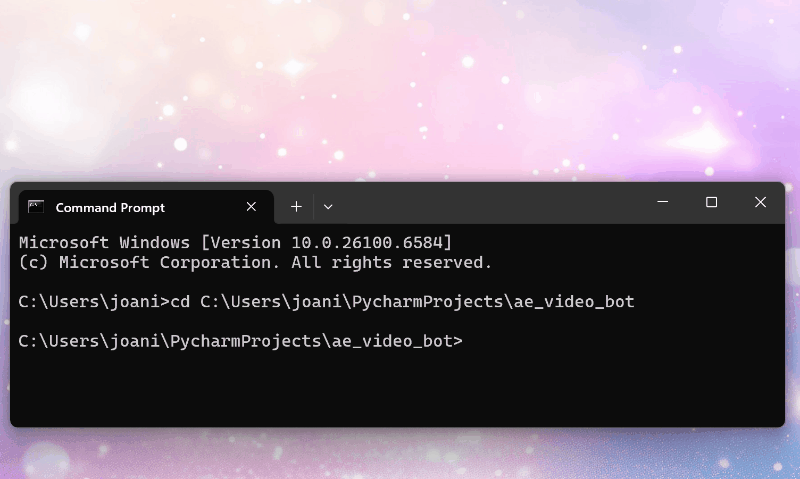
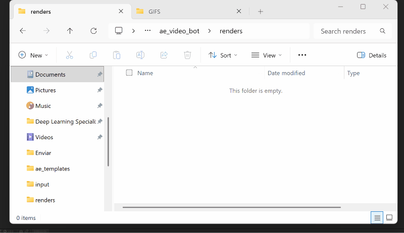

# After Effects Batch Automation – Face & Name Replacement

## Overview

Batch rendering in After Effects is often **manual and repetitive**: replacing layers, updating text, queuing renders.

I built an **automated pipeline** that does all of this in **one command**:

- Python prepares the job list from image + text files.
- ExtendScript automates After Effects:
  - Replaces face + name layers.
  - Duplicates comps and queues renders.
  - Saves all jobs into a **master project file** for archival.

---

## Demo

### Full Workflow

**Dropping files into the `input/` folder**


**Running the Python script**



**Renders folder automatically populated**



**After Effects master file grows with new comps**


---

## Project Structure

ae_video_bot/
├── input/ # Aoife.png + Aoife.txt, Charlie.jpg + Charlie.txt, etc.
├── renders/ # Aoife.avi, Charlie.avi, etc.
├── ae_templates/
│ ├── ae_faces and names_template.aep # clean template
│ ├── ae_faces_and_names_master.aep # growing master archive
├── run_batch.py # Python launcher (auto-pairs files)
├── replace_and_render_batch.jsx # AE automation script
└── archive/ # old versions of scripts


---

## Workflow

1. Place matching files into the `input/` folder:  
   - `Aoife.png` and `Aoife.txt`  
   - `Charlie.jpg` and `Charlie.txt`

2. Run the Python launcher:
   ```bash
   python run_batch.py

3. After Effects will:
  Open the template.
  Process each input pair.
  Render Aoife.avi, Charlie.avi, etc. into renders/.
  Save/append the results into ae_faces_and_names_master.aep.
  The input/ files remain untouched.

## Technical Notes

Comp names → Each duplicated comp is renamed as Intro_Template_Comp [NAME].
Filename sanitization → Spaces and special characters in names are replaced with _ for safe filenames.
Output module → Uses AE’s Lossless template by default (can be changed).

## Requirements

Adobe After Effects 2023+
Python 3.x

## Troubleshooting

Disk Cache warnings
If AE shows acecache errors, clear cache via:
AE Preferences → Media & Disk Cache → Empty Disk Cache
Or manually delete contents of: %LOCALAPPDATA%\Adobe\After Effects\23.1\Disk Cache
Undo group mismatch
Harmless; resolved by removing undo groups in JSX.
File missing warnings
Ensure every .png/.jpg has a corresponding .txt.

## Future Extensions
Add MP4/H.264 export preset.
Write a log file (batch_log.txt) of processed jobs.
Pull job data from Google Sheets or Notion.
Add GUI front-end for drag-and-drop batches.

**Author:** Joana Button

